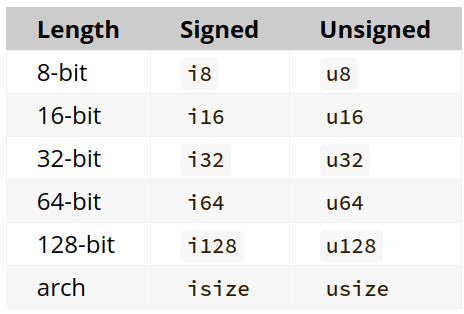

# Variables

In Rust, variables are immutable by default.
When a variable is immutable, once a value is bound to a name, you can’t change that value.
You can make them mutable by adding `mut` in front of the variable name.

## Further information

- [Variables and Mutability](https://doc.rust-lang.org/book/ch03-01-variables-and-mutability.html)

## ANA

## Data Types

Every value in Rust is of a certain data type, which tells Rust what kind of data is being specified so it knows how to work with that data. We’ll look at two data type subsets: scalar and compound.

Keep in mind that Rust is a **statically typed language**, which means that it **must know the types of all variables at compile time**. The compiler can usually infer what type we want to use based on the value and how we use it. In cases when many types are possible, such as when we converted a String to a numeric type using parse in the “Comparing the Guess to the Secret Number” section in Chapter 2, we must add a type annotation, like this:

let guess: u32 = "42".parse().expect("Not a number!");

If we don’t add the : u32 type annotation shown in the preceding code, Rust will display the following error, which means the compiler needs more information from us to know which type we want to use:


## Scalar Types
A scalar type represents a single value. Rust has four primary scalar types: integers, floating-point numbers, Booleans, and characters. You may recognize these from other programming languages. Let’s jump into how they work in Rust.


## Integer Types
An integer is a number without a fractional component. We used one integer type in Chapter 2, the u32 type. This type declaration indicates that the value it’s associated with should be an unsigned integer (signed integer types start with i instead of u) that takes up 32 bits of space. Table 3-1 shows the built-in integer types in Rust. We can use any of these variants to declare the type of an integer value.


>


Each signed variant can store numbers from -(2n - 1) to 2n - 1 - 1 inclusive, where n is the number of bits that variant uses. So an i8 can store numbers from -(27) to 27 - 1, which equals -128 to 127. Unsigned variants can store numbers from 0 to 2n - 1, so a u8 can store numbers from 0 to 28 - 1, which equals 0 to 255.

Additionally, the isize and usize types depend on the architecture of the computer your program is running on, which is denoted in the table as “arch”: 64 bits if you’re on a 64-bit architecture and 32 bits if you’re on a 32-bit architecture.

## Floating-Point Types
Rust also has two primitive types for floating-point numbers, which are numbers with decimal points. Rust’s floating-point types are f32 and f64, which are 32 bits and 64 bits in size, respectively. The default type is f64 because on modern CPUs, it’s roughly the same speed as f32 but is capable of more precision. All floating-point types are signed.
```

fn main() {
    let x = 2.0; // f64

    let y: f32 = 3.0; // f32
}
```

## Numeric Operations

```

fn main() {
    // addition
    let sum = 5 + 10;

    // subtraction
    let difference = 95.5 - 4.3;

    // multiplication
    let product = 4 * 30;

    // division
    let quotient = 56.7 / 32.2;
    let truncated = -5 / 3; // Results in -1

    // remainder
    let remainder = 43 % 5;
}

```

## The Boolean Type
As in most other programming languages, a Boolean type in Rust has two possible values: true and false. Booleans are one byte in size. The Boolean type in Rust is specified using bool. For example:

```


fn main() {
    let t = true;

    let f: bool = false; // with explicit type annotation
}

```

## The Character Type

Rust’s char type is the language’s most primitive alphabetic type. Here are some examples of declaring char values:

```
fn main() {
    let c = 'z';
    let z: char = 'ℤ'; // with explicit type annotation
    let heart_eyed_cat = '😻';
}
```

Note that we specify char literals with single quotes, as opposed to string literals, which use double quotes. Rust’s char type is four bytes in size and represents a Unicode Scalar Value, which means it can represent a lot more than just ASCII. Accented letters; Chinese, Japanese, and Korean characters; emoji; and zero-width spaces are all valid char values in Rust. Unicode Scalar Values range from U+0000 to U+D7FF and U+E000 to U+10FFFF inclusive. However, a “character” isn’t really a concept in Unicode, so your human intuition for what a “character” is may not match up with what a char is in Rust. We’ll discuss this topic in detail in “Storing UTF-8 Encoded Text with Strings” in Chapter 8.


# Compound Types
Compound types can group multiple values into one type. Rust has two primitive compound types: tuples and arrays.

## The Tuple Type
A tuple is a general way of grouping together a number of values with a variety of types into one compound type. Tuples have a fixed length: once declared, they cannot grow or shrink in size.

We create a tuple by writing a comma-separated list of values inside parentheses. Each position in the tuple has a type, and the types of the different values in the tuple don’t have to be the same. We’ve added optional type annotations in this example:

Filename: src/main.rs
```

fn main() {
    let tup: (i32, f64, u8) = (500, 6.4, 1);
}
```


The variable tup binds to the entire tuple because a tuple is considered a single compound element. To get the individual values out of a tuple, we can use pattern matching to destructure a tuple value, like this:


```

fn main() {
    let tup = (500, 6.4, 1);

    let (x, y, z) = tup;

    println!("The value of y is: {y}");
}

```


```
fn main() {
    let x: (i32, f64, u8) = (500, 6.4, 1);

    let five_hundred = x.0;

    let six_point_four = x.1;

    let one = x.2;
}


```

# The Array Type

```

fn main() {
    let a = [1, 2, 3, 4, 5];
    let months = ["January", "February", "March", "April", "May", "June", "July",
              "August", "September", "October", "November", "December"];

}
```
```


let a: [i32; 5] = [1, 2, 3, 4, 5];
let a = [3; 5];

fn main() {
    let a = [1, 2, 3, 4, 5];

    let first = a[0];
    let second = a[1];
}


```


